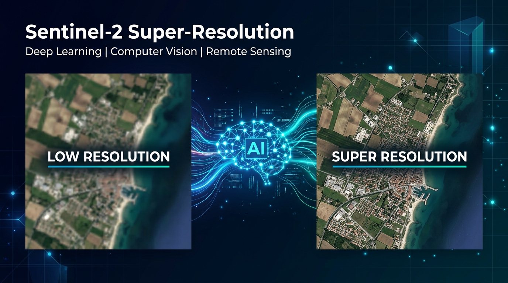
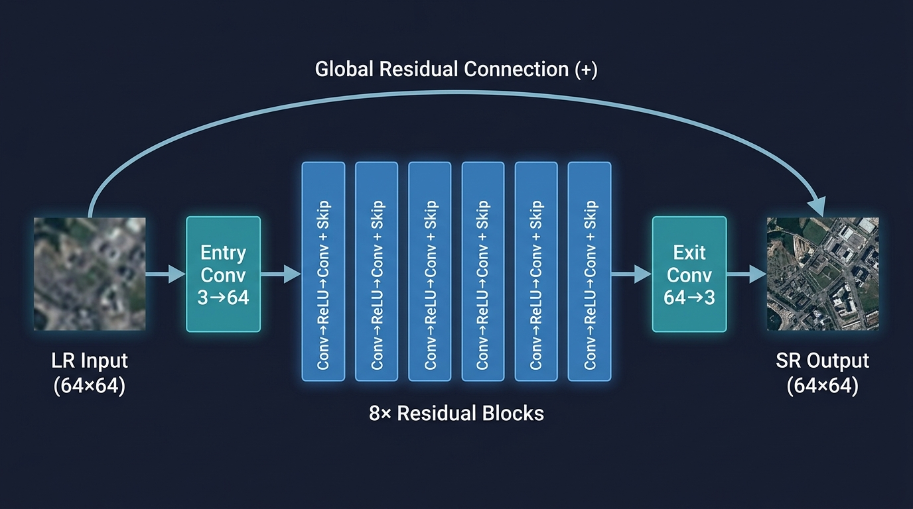
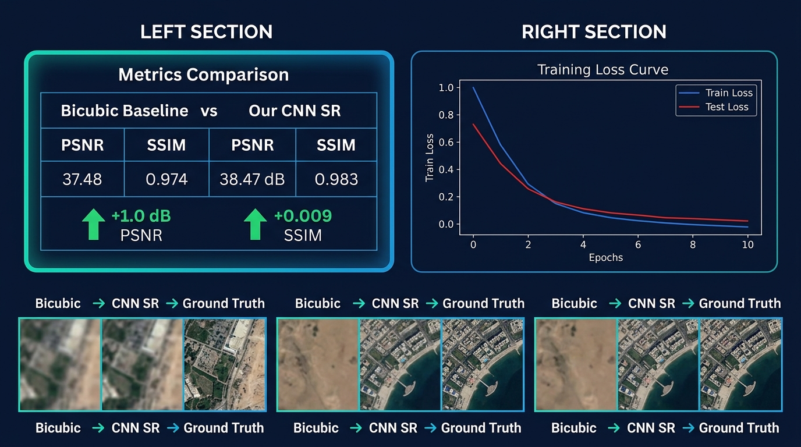

# 🛰️ Sentinel-2 Super-Resolution with Deep Learning

> **Upscaling Sentinel-2 satellite imagery from 20m to 10m resolution using a Residual CNN**




## 📋 Table of Contents

- [Overview](#-overview)
- [Key Features](#-key-features)
- [Architecture](#-architecture)
- [Results](#-results)
- [Dataset](#-dataset)
- [Quick Start](#-quick-start)
- [Tech Stack](#-tech-stack)
- [References](#-references)
- [License](#-license)

## 🎯 Overview

The **Sentinel-2** mission by ESA captures Earth's surface with 13 spectral bands at three different spatial resolutions: **10m**, **20m**, and **60m**. This resolution mismatch limits joint analysis across spectral bands.

This project implements a **Residual Convolutional Neural Network** for single-image super-resolution (SISR), learning to recover high-frequency spatial details lost during the downsampling process. The model effectively simulates the upscaling of 20m bands to 10m resolution, outperforming classical bicubic interpolation.

### The Problem
When stacking all Sentinel-2 bands for machine learning or spectral index computation, lower-resolution bands require resampling. Simple interpolation (bicubic, bilinear) produces blurry outputs lacking the spatial detail present in native 10m bands.

### The Solution
A deep learning model that predicts only the missing high-frequency **residual** — the difference between the blurry input and the sharp target — making training faster and more stable.

## ✨ Key Features

- 🧠 **Residual CNN Architecture** — 8 residual blocks with local + global skip connections
- 📊 **Proper Train/Test Split** — 80/20 split with seed for reproducibility, preventing data leakage
- 📈 **Quantitative Evaluation** — PSNR & SSIM metrics on unseen test data
- 🗂️ **EuroSAT Dataset** — 27,000 Sentinel-2 derived patches (64×64 px, 10 land-use classes)
- ⚡ **GPU Accelerated** — Designed for Google Colab with CUDA support
- 📉 **Loss Monitoring** — Train & test loss curves to verify convergence

## 🏗️ Architecture

The **SuperResNet** architecture is inspired by [SRCNN](https://arxiv.org/abs/1501.00092) (Dong et al., 2014) and [EDSR](https://arxiv.org/abs/1707.02921) (Lim et al., 2017):



### Architecture Details

| Component | Specification |
|-----------|:-------------|
| **Input** | Bicubic-upsampled LR image (3×64×64) |
| **Entry Block** | Conv2d(3→64) + ReLU |
| **Residual Blocks** | 8 blocks, each: Conv3×3→ReLU→Conv3×3 + local skip |
| **Exit Block** | Conv2d(64→3) |
| **Global Skip** | Output = Input + Predicted Residual |
| **Loss Function** | MSE (L2) |
| **Optimizer** | Adam (lr=0.001) |
| **Total Parameters** | ~370,000 |

### How It Works

1. **Degradation Simulation**: High-resolution patches are downsampled (bicubic ×2) then upsampled back, creating synthetic LR/HR pairs
2. **Residual Learning**: The network learns only the high-frequency residual `R(x)`, and the final output is `x + R(x)`
3. **Skip Connections**: Both local (within each block) and global (input to output) skip connections stabilize training

## 📊 Results



Our lightweight ResNet consistently outperforms bicubic interpolation on unseen test data:

| Metric | Bicubic Baseline | CNN SR (Ours) | Improvement |
|--------|:---:|:---:|:---:|
| **PSNR (dB)** | 37.48 | **38.47** | 📈 **+1.0 dB** |
| **SSIM** | 0.974 | **0.983** | 📈 **+0.009** |

### Key Findings

- ✅ CNN SR achieves **+1.0 dB PSNR** improvement over bicubic interpolation
- ✅ **SSIM improvement of +0.009** indicates better structural preservation
- ✅ Training and test loss curves converge smoothly without overfitting
- ✅ Visually, the CNN recovers sharper edges along building boundaries, field borders, and water-land transitions

## 🗂️ Dataset

We use the [EuroSAT](https://github.com/phelber/eurosat) dataset (Helber et al., 2019):

- **27,000** Sentinel-2 satellite image patches
- **64×64 pixels** per patch
- **10 land-use classes**: Industrial, Residential, Annual Crop, Forest, etc.
- **Split**: 80% train (21,600) / 20% test (5,400) with `seed=42`

## 🚀 Quick Start

### Option 1: Google Colab (Recommended)

1. Open `Sentinel2_SuperResolution.ipynb` in Google Colab
2. Enable GPU: `Runtime → Change runtime type → GPU`
3. Run all cells — the notebook automatically:
   - 📥 Downloads the EuroSAT dataset
   - ✂️ Creates train/test split (80/20)
   - 🏋️ Trains the model (10 epochs)
   - 📊 Evaluates on unseen test data
   - 🖼️ Visualizes Bicubic vs CNN SR vs Ground Truth

### Option 2: Local Setup

```bash
# Clone the repository
git clone https://github.com/FoaadAbbas/Sentinel2-SuperResolution.git
cd Sentinel2-SuperResolution

# Install dependencies
pip install torch torchvision matplotlib numpy

# Run the notebook
jupyter notebook Sentinel2_SuperResolution.ipynb
```

## 🔧 Tech Stack

| Tool | Purpose |
|------|---------|
| **Python 3.10** | Programming language |
| **PyTorch 2.x** | Deep learning framework |
| **torchvision** | Dataset loading & image transforms |
| **matplotlib** | Visualization & plotting |
| **NumPy** | Numerical operations |
| **Google Colab** | Cloud GPU environment |

## 📚 References

| Paper | Year | Contribution |
|-------|:----:|-------------|
| [SRCNN](https://arxiv.org/abs/1501.00092) — Dong et al. | 2014 | First end-to-end CNN for super-resolution |
| [Deep Residual Learning](https://arxiv.org/abs/1512.03385) — He et al. | 2015 | Introduced residual learning |
| [EuroSAT](https://arxiv.org/abs/1709.00029) — Helber et al. | 2019 | Sentinel-2 land use classification dataset |
| [DSen2](https://arxiv.org/abs/1803.04271) — Lanaras et al. | 2018 | Deep CNN for Sentinel-2 super-resolution |
| [EDSR](https://arxiv.org/abs/1707.02921) — Lim et al. | 2017 | Enhanced deep residual networks for SR |
| [ESRGAN](https://arxiv.org/abs/1809.00219) — Wang et al. | 2018 | GAN-based super-resolution |
| [DiffFuSR](https://arxiv.org/abs/2506.11764) | 2025 | Diffusion-based SR for all 13 Sentinel-2 bands |

## 🔮 Future Work

- 🌐 Extend to all **13 Sentinel-2 bands** (not just RGB)
- 🎨 Implement **perceptual loss** and **GAN-based** training (ESRGAN) for sharper visual results
- 📡 Train on real **SEN2NAIP / WorldStrat** tiles for production-ready super-resolution
- 🔬 Integrate **diffusion models** following the DiffFuSR approach

## 👤 Author

**Foaad Abbas** — B.Sc. Software Engineering, Braude College of Engineering

- 🔗 [LinkedIn](https://linkedin.com/in/YOUR_LINKEDIN)
- 💻 [GitHub](https://github.com/FoaadAbbas)

## 📄 License

This project is licensed under the MIT License — see the [LICENSE](LICENSE) file for details.

---

⭐ **If you found this project useful, please give it a star!**
